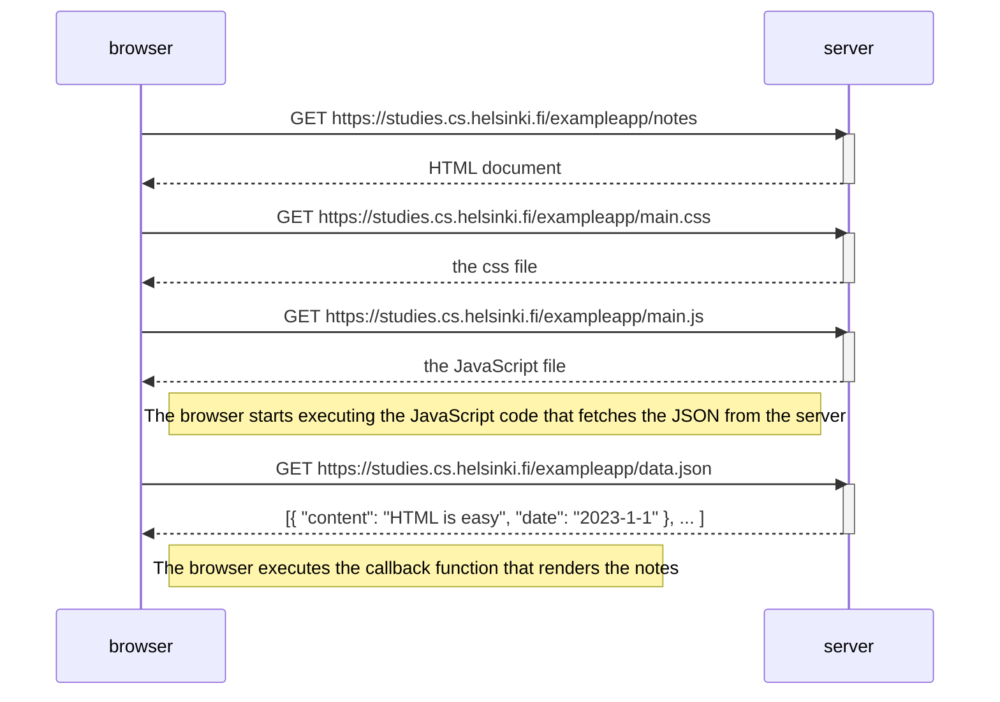

```mermaid
sequenceDiagram
    participant browser
    participant server
    browser->>server: POST https://studies.cs.helsinki.fi/exampleapp/new_note
    activate server
    server-->>browser: redirect to notes
    deactivate server
    Note right of browser: Browser sends new new note new_note address, appending note to the notes list
    browser->>server: GET https://studies.cs.helsinki.fi/exampleapp/notes
    activate server
    server-->> browser: notes webpage
    deactive server
    browser->>server: GET https://studies.cs.helsinki.fi/exampleapp/main.css
    activate server
    server-->>browser: CSS stylesheet
    deactivate server
    browser->>server: GET https://studies.cs.helsinki.fi/exampleapp/main.js
    activate server
    server-->>browser: JavaScript code for rendering list
    deactivate server
    Note right of browser: Browser begins to execute JS code.
    browser->>server: GET https://studies.cs.helsinki.fi/exampleapp/data.json
    activate server
    server-->>browser: list of notes, actual
    deactivate server
    Note right of browser: Browser executes callback to render notes list.
```

