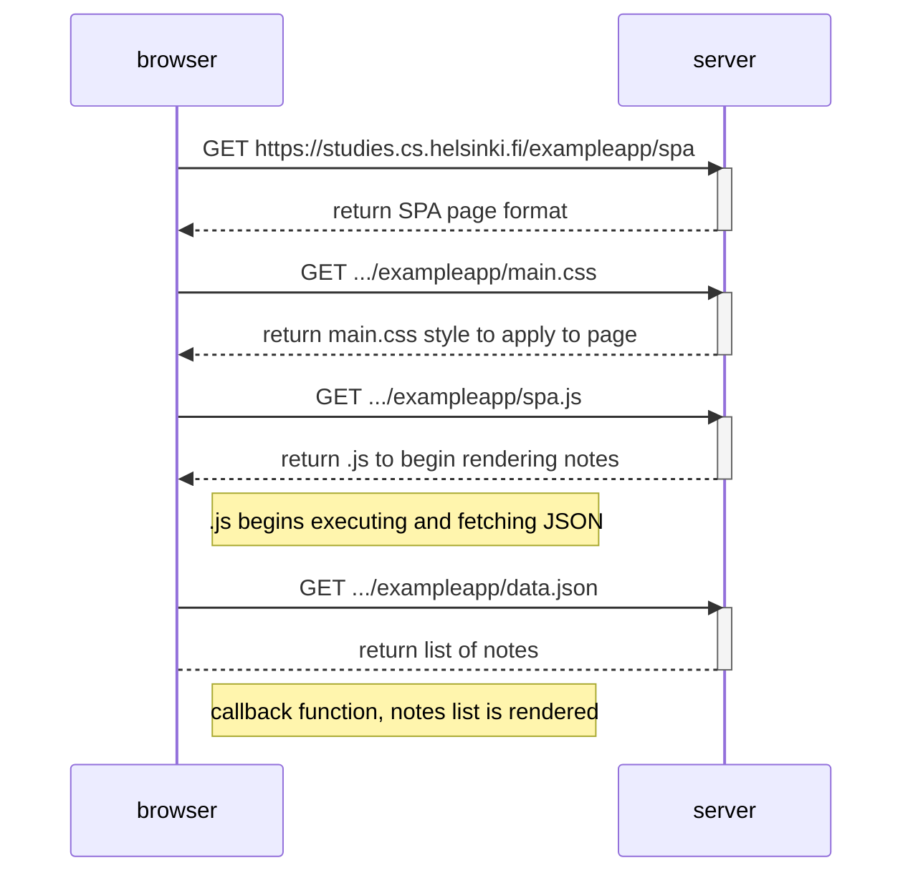

```mermaid
sequenceDiagram
    participant browser
    participant server

	browser->>server: GET https://studies.cs.helsinki.fi/exampleapp/spa
	activate server
	server-->>browser: return SPA page format
	deactivate server

	browser->>server: GET .../exampleapp/main.css
	activate server
	server-->>browser: return main.css style to apply to page
	deactivate server

	browser->>server: GET .../exampleapp/spa.js
	activate server
	server-->>browser: return .js to begin rendering notes
	deactivate server

	Note right of browser: .js begins executing and fetching JSON

	browser->>server: GET .../exampleapp/data.json
	activate server
	server-->browser: return list of notes
	deactivate server

	Note right of browser: callback function, notes list is rendered
```
