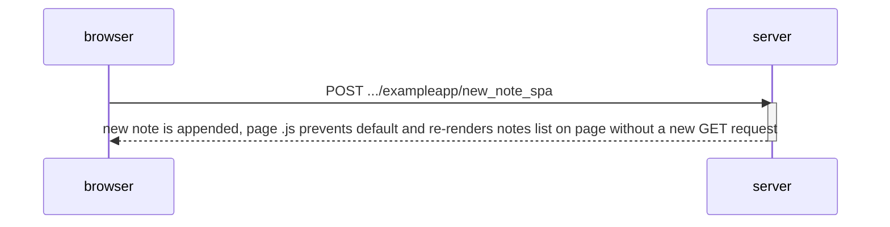

```mermaid
sequenceDiagram
    participant browser
    participant server

    browser->>server: POST .../exampleapp/new_note_spa
    activate server
    server-->>browser: new note is appended, page .js prevents default and re-renders notes list on page without a new GET request
    deactivate server
```
